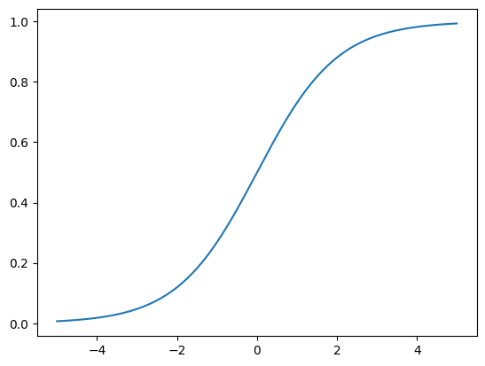
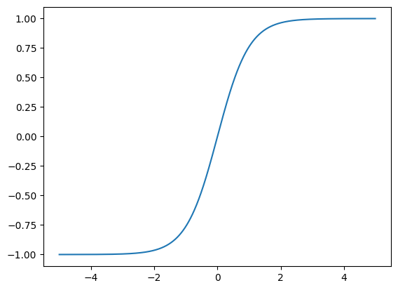
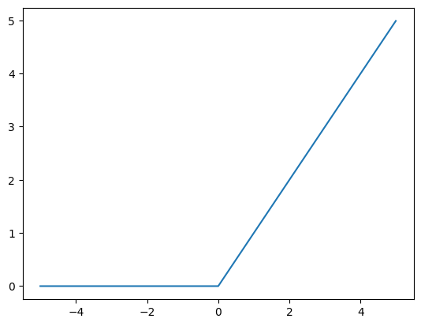
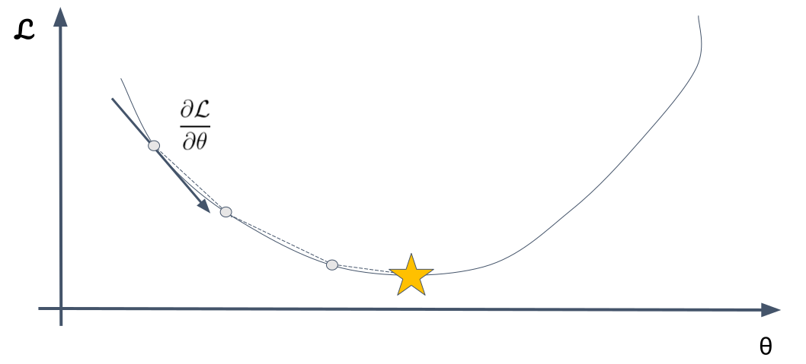

# Machine Learning for NLP

---

## What is a neural network

* Computational model inspired by the functioning of the human brain
* Building block of deep learning
* Interconnected layers known as **neurons** organized into **layers**

---

## Structure of a neural network

* Input Layers
* Hidden Layers
* Weights and Biases
* Activation Function
* Output Layer

---
<!-- .slide: data-background="#ccc" -->


---

## Input Layer

Takes the input signal

In NLP this is typically text

Must be mapped to continuous values by **word embeddings**

---

## Hidden Layer

Intermediate layer between input and output layers

Processes information from previous layer to the next layer

---

## Weights and Biases

Each layer has at least one linear transformation

$$\mathbf{y} = \mathbf{Ax} + \mathbf{b}$$

Where

* $\mathbf{x}$ is the (hidden) input vector
* $\mathbf{y}$ is the (hidden) output vector
* $\mathbf{A}$ is a learned weight matrix
* $\mathbf{b}$ is a learned bias

---

## Activation Functions

Activation function introduces a **non-linearity** into a network

Popular choices:

* Sigmoid Function
* Hyperbolic Tangent
* ReLU and relatives

---

## Sigmoid Function

$$\sigma(x) = \frac{e^x}{1+e^x}$$

---



---

## Hyperbolic Tangent Fuction

$$\tanh(x) = \frac{e^x - e^{-x}}{e^x + e^{-x}}$$

---



---

## ReLU - Rectified Linear Unit

$$\text{relu}(x) = \left\lbrace \begin{array}{cc} x & \text{if}~x > 0 \\ 0 & \text{otherwise} \end{array} \right.$$

There are also smooth variants of ReLU such as **softplus** and **GeLU**

---



---

## Output Layer

Produces the result or predictions

Depends on the task

---

## Softmax Output

$$\text{softmax}_i(\mathbf{x}) = \frac{e^{x_i}}{\sum_j e^{x_j}}$$

Output is a probability distribution over the outcomes.

---

## Non-linear optimization

A neural network can be considered as a function

$$f(\mathbf{x} ; \mathbf{w})$$

Where $\mathbf{x}$ are the inputs and $\mathbf{w}$ are the learnable weights

---

## A neural network

$$f(\mathbf{x} ; \mathbf{w}) = f_n(\mathbf{h_n}; \mathbf{w_n})$$

$$\mathbf{h_n} = f_{n-1}(\mathbf{h_{n-1}}; \mathbf{w_{n-1}})$$

...

$$\mathbf{h_1} = f_0(\mathbf{x}; \mathbf{w_{n-1}}$$

---

## How to train a neural network?

1. Initialize Weights and Biases
2. Define the Loss Function
3. Forward Propagation
4. Backpropagation
5. Update Weights and Biases

---
<!-- .slide: data-background="#ccc" -->



---

## Initialize Weights and Biases

Bad Choices:

* All zeros
* Very large values

Good Choices:

* Random moderate values

---

## Loss functions

The loss functions measures the quality of the current solution

The goal of optimization is to minimize this function

$$\min_\mathbf{w} \mathcal{L}(\mathbf{w})$$

---

## Mean Squared Error

Measures the Euclidean loss between the system output and the data

$$\mathcal{L}(\mathbf{w}) = \sum (y_i - f(x_i; \mathbf{w}))^2$$

---

## Cross-Entropy Loss

Used two compare two probability distributions

$$\mathcal{L}(\mathbf{w}) = \sum -(y_i \log(p_i) + (1 - y_i) \log(1 - p_i))$$

Assume $0 \leq y_i \leq 1$, $0 < p_i < 1$

---

## Forward Propogation

Calculate all the results and all the hidden layer values

---

## Backpropogation

We calculate the gradient of the function in order to classify

$$\frac{\partial \mathcal{L}}{\partial \mathbf{w}}$$

This is done by backpropagation, e.g.,

$$\frac{\partial \mathcal{L}}{\partial \mathbf{w_i}} = \frac{\partial \mathcal{L}}{\partial \mathbf{h_i}} \frac{\partial \mathbf{h_i}}{\partial \mathbf{w_i}}$$

---

## Automatric Differentiation

Calculus is hard... computers can do it for us

```python
import jax

f = lambda x: x**3 + 2*x**2 - 3*x + 1

dfdx = jax.grad(f)
```

---

## Update Weights and Bias

We update the weights by gradient descent

$$\mathbf{w}' \leftarrow \mathbf{w} - \eta \frac{\partial \mathcal{L}}{\partial \mathbf{w}}$$

$\eta$ is a magic constant called the **learning rate**.

---

## Issues with Gradient Descent

1. May not converge
2. Loss is expensive to calculate
3. Learning rate needs to vary

---

## Stochastic Gradient Descent

In **stochastic** gradient descent, we simply take a random section of the data
called a **mini-batch** and evaluate the loss function on this

* Much faster (only using a 20-100 data points)
* Avoids some training issues (due to random selection)

---

## Adaptive Learning Rate

We have a learning rate for each parameter

$$w_i' \leftarrow w_i - \eta_i \frac{\partial \mathcal{L}}{\partial w_i}$$

Most popular method to calculate this is **Adam** an adaptive method with moments

---

## Topics for discussion this week

1. Why use non-linearities in a neural network?
2. Plot and experiment with non-linear functions.
3. What is the relation between sigmoid and tanh?
4. Plot and experiment with loss functions.
5. Try auto-differentiation
6. Train a simple neural network
7. Experiment with initialization parameters.

