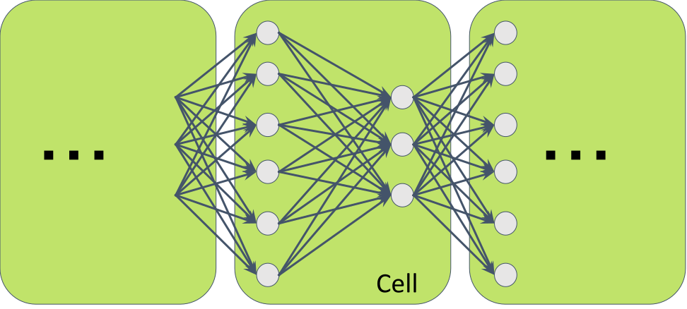
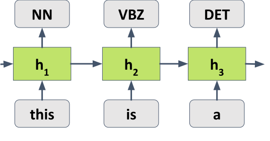
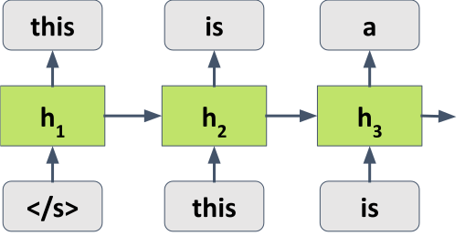
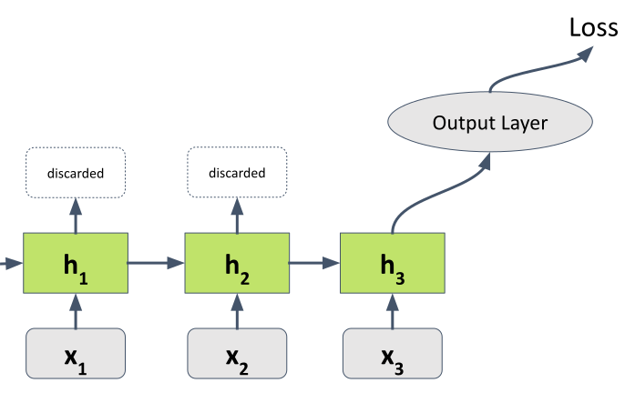
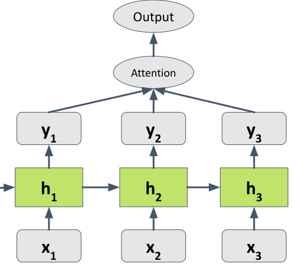
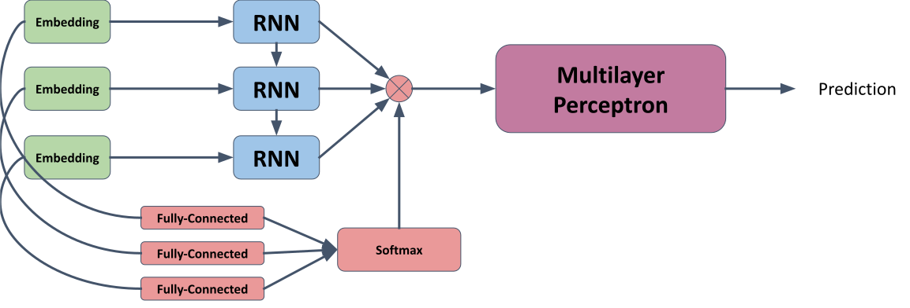
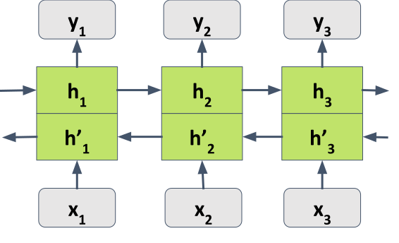
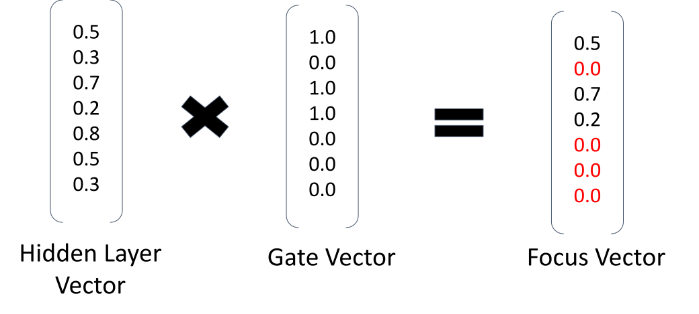
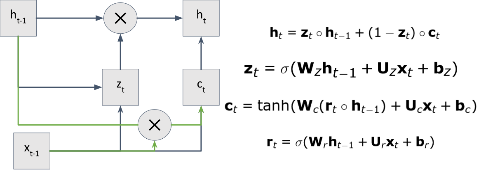

# Recurrent Neural Networks

---

## Input to NLP

In other tasks, such as computer vision images can be scaled to a fixed size. However, in NLP, the input can be of variable length.

---


---

"This is an example" => "Ti sa xml"

---

## Sequence models

- Sequence models are deep learning models that are used for **time series** data or **sequential** data.
- Examples:
  - Speech recognition
  - Music generation
  - Sentiment classification
  - DNA sequence analysis
  - Machine translation
  - Video activity recognition
  - Name entity recognition
  - ...

---

## Recurrent Neural Network model

- Notation:
  - $x^{t}$: Input at time $t$.
  - $h^{t}$: Hidden state at time $t$.
  - $y^{t}$: Output at time $t$.

$$ h^{t} = f(h^{t-1}, x^{t}) $$

$$ y^{t} = g(h^{t}) $$

---

## Parameter sharing in RNNs

We can use the same weights for every time step.

$$ h^{t} = f(h^{t-1}, x^{t}; \mathbf{W}) $$

$$ y^{t} = g(h^{t}; \mathbf{W}) $$

---

<!-- .slide: data-background="#ccc" -->


---

Networks can be unrolled in time.

<!-- .slide: data-background="#ccc" -->


---

## Simple RNN

$$ y_i = f(\mathbf{W}_{hy} h_i + b_y) $$

$$ h_i = g(\mathbf{W}_{hh} h_{i-1} + \mathbf{W}_{xh} x_i + b_h) $$

Initially, $h_0$ is set to zero. $f$ and $g$ are non-linear activation functions.

---

## RNNs for tagging

- Input: a sequence of words $x_1, \ldots, x_n$.
- Output: a sequence of tags $y_1, \ldots, y_n$.

The output can be computed directly using a softmax layer.

---

<!-- .slide: data-background="#ccc" -->


---

## RNNs for language modeling

- Input: a sequence of words $x_1, \ldots, x_n$.
- Output: the probability of the next word $x_{n+1}$.

Again a softmax output layer can be used to compute the probability distribution.

---

<!-- .slide: data-background="#ccc" -->


---

## RNNs for classification (acceptor)

Simple use of an RNN is as an acceptor. The final state of the RNN is used to classify the input sequence.

$$ y = f(\mathbf{W}_{hy} h_n + b_y) $$

No prediction is made for other time steps.

---

<!-- .slide: data-background="#ccc" -->
 

---

### RNNs for classification (attention)

Instead of discarding the hidden states, we can use them to compute a weighted sum of the hidden states.

$$ y = f(\sum_{i=1}^n \alpha_i h_i) $$

$$ \alpha_i = \frac{\exp(\mathbf{w}_{\alpha}^T h_i)}{\sum_{j=1}^n \exp(\mathbf{w}_{\alpha}^T h_j)} $$

---

<!-- .slide: data-background="#ccc" -->


---

## Embed, encode, attend, predict

<!-- .slide: data-background="#ccc" -->


---

Read this article:

https://explosion.ai/blog/deep-learning-formula-nlp

---

## Bidirectional RNNs

- In some cases, we want to use information from the future.
- We can use a bidirectional RNN to do this.
- The hidden state is computed from both the past and the future.

---

<!-- .slide: data-background="#ccc" -->


---

## Bidirectional RNNs (formulae)

$$ \overrightarrow{h}_i = f(\mathbf{W}_{\overrightarrow{hh}} \overrightarrow{h}_{i-1} + \mathbf{W}_{\overrightarrow{xh}} x_i + b_{\overrightarrow{h}}) $$

$$ \overleftarrow{h}_i = f(\mathbf{W}_{\overleftarrow{hh}} \overleftarrow{h}_{i+1} + \mathbf{W}_{\overleftarrow{xh}} x_i + b_{\overleftarrow{h}}) $$

$$ h_i = \overrightarrow{h}_i + \overleftarrow{h}_i $$

---

## Backpropagation through time

- Gradients in a RNN are harder to compute than in a feedforward network.
- This is because the same weights are used at each time step.
- The gradients are summed over time steps.

---

## Vanishing gradients

- The gradients can become very small.
- This is because the gradients are multiplied by the same weights at each time step.
- This is called the vanishing gradient problem.

---

## Exploding gradients

- Alternatively, the gradients can become very large (exploding gradients).
- One way to deal with exploding gradients is to clip the gradients.
- If the gradient norm is larger than a threshold, the gradients are scaled down.

---

## Gating

- Gating is a way to control the flow of information in a RNN.
- Gating can be used to deal with the vanishing gradient problem.

---

## What is a gate?

- A gate is a function that takes two inputs and produces an output.
- The output is the pairwise product of the inputs.

$$ \mathbf{g} = \mathbf{x} \odot \mathbf{y} $$

---

<!-- .slide: data-background="#ccc" -->


---

## Gated Recurrent Unit (GRU)

- The GRU is a gated RNN.
- It has two gates: an update gate and a reset gate.
- The update gate controls how much of the previous state is kept.
- The reset gate controls how much of the previous state is forgotten.

---

<!-- .slide: data-background="#ccc" -->


_for reference only_

---

## Long Short-Term Memory (LSTM)

- The LSTM is a more complex gated RNN.
- It has three gates: an input gate, an output gate and a forget gate.
- The input gate controls how much of the input is kept.
- The output gate controls how much of the state is output.
- The forget gate controls how much of the state is forgotten.

---

<!-- .slide: data-background="#ccc" -->

_for reference only_

---

## GRUs and LSTMs

- In practice, GRUs and LSTMs perform similarly.
- GRUs are simpler and faster to train.
- LSTMs are more flexible and can be used in more complex situations.

---

## RNNs in PyTorch

- PyTorch has a `RNN` module.
- It can be used to implement a simple RNN.
- It can also be used to implement a GRU or LSTM.

```python
rnn = nn.RNN(10, 20, 2)
input = torch.randn(5, 3, 10)
h0 = torch.randn(2, 3, 20)
output, hn = rnn(input, h0)
```


