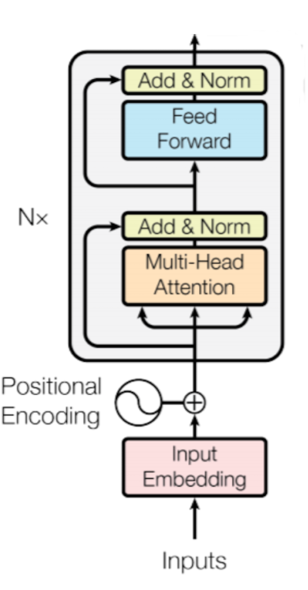
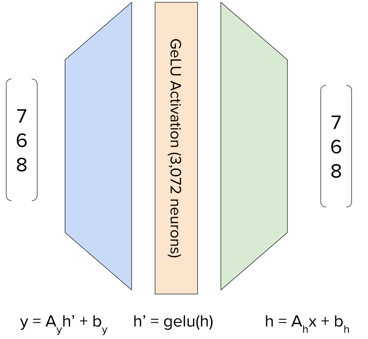
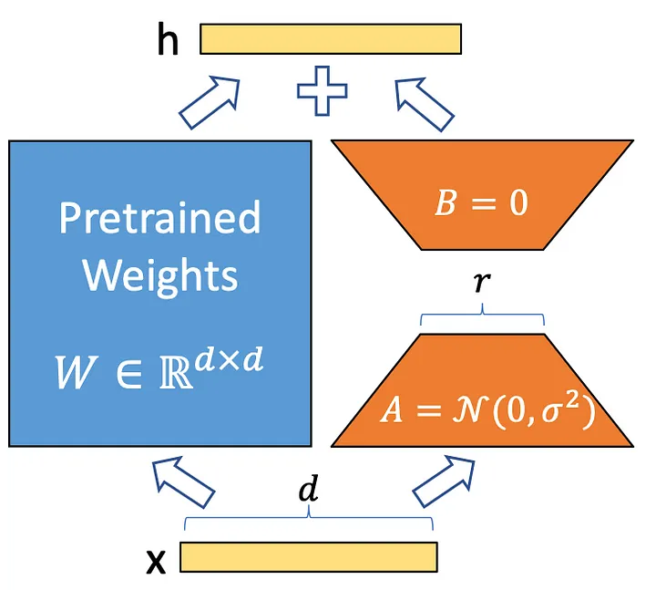

# Transformers

---

## Motivation

- RNNs are slow and hard to parallelize
- RNNs are not able to capture long-term dependencies
- An alternative to RNNs are Transformers

---

## Transformers

- Transformers are based on the idea of self-attention
- Self-attention is a mechanism that allows to compute the representation of a word based on all other words in the sentence
- In this way, transformers are able to capture long-term dependencies

---

## Self-Attention

- In self-attention, the attention of a word is computed based on all other words in the sentence
- The attention of a word is computed by taking the dot product of the word with all other words

---

## Self-Attention

- In self-attention we compute three vectors for each word: Query, Key, Value
- Each of these vectors is a simple linear transformation of the word embedding

`$$
\begin{aligned}
q_i &= W_Q x_i + b_Q\\
k_i &= W_K x_i + b_K\\
v_i &= W_V x_i + b_V
\end{aligned}
$$`

---

## Self-Attention

- We calculate the attention of a word as the dot product of the query and key vectors

`$$
a_{ij} = \frac{q_i \cdot k_j}{\sqrt{d_k}}
$$`

_Note: $d_k$ is the dimensionality of the key vectors, it was introduced by
Vaswani et al. to make the optimization more stable_

---

## Self-Attention

- As usual, we apply a softmax to get a probability distribution over the words

`$$
\alpha_{ij} = \frac{\exp(a_{ij})}{\sum_{k=1}^n \exp(a_{ik})}
$$`

---

## Self-Attention

- The output vector is then computed as the weighted sum of the value vectors

`$$
y_i = \sum_{j=1}^n \alpha_{ij} v_j
$$`

---

## Multi-Head Attention

- To improve the representation power, we compute multiple attention vectors from the same input
- We divide the query, key and value vectors into $h$ equal parts

`$$
\left( \begin{array}{c} q^1 \\ \vdots \\ q^h \end{array} \right) = W_Q x_i + b_Q
$$`

---

## Multi-Head Attention

- We can then compute the attention vectors as before

`$$
a_{ij}^k = \frac{q_i^k \cdot k_j^k}{\sqrt{d_k}}
$$`

---

## Parallelization

- We can calculate all the attentions in a sequence in parallel

`$$
Q = W_Q X + b_Q
$$`

- Matrix multiplication is highly parallelizable on GPUs

---

## Parallelization

- We can also calculate all the attention vectors in parallel

`$$
\begin{aligned}
A = \frac{Q K^T}{\sqrt{d_k}}\\
A' = \text{softmax}(A)\\
Y = A' V
\end{aligned}
$$`

---

## The Transformer Architecture

- The key components of the transformer architecture are:
  - Multi-head attention
  - Layer normalization
  - Residual connections
  - Feed-forward layers
  - Positional encoding

---

<!-- .slide: data-background="#fff" -->


---

## Residual Connections

- Residual connections are a way to make it easier for the network to learn
- Gradients in deeper networks tend to vanish
- Residual connections allow the gradient to flow directly to the lower layers

---

## Residual Connections

`$$
\begin{aligned}
y &= f(h) + h\\
h &= g(x) + x\\
\frac{\partial h}{\partial x} &= \frac{\partial g(x)}{\partial x} + 1\\
\frac{\partial y}{\partial h} &= \frac{\partial f(h)}{\partial h} + 1\\
\frac{\partial y}{\partial x} &= \frac{\partial f(h)}{\partial h} \frac{\partial g(x)}{\partial x} + \frac{\partial f(h)}{\partial h} + \frac{\partial g(x)}{\partial x} + 1\\
\end{aligned}
$$`

---

## Layer Normalization

- Layer normalization is a technique to normalize the activations of a layer
- Normalizing the activations makes it easier for the network to learn
- Layer normalization was introduced as an alternative to batch normalization

---

## Batch Normalization

- Batch normalization normalizes the activations of a layer over the batch dimension
- We calculate the mean and variance of the values of a neuron in this batch
- We then normalize the values of the neuron using the mean and variance

---

## Layer Normalization

- In layer normalization, the mean and variance are calculated over all neurons in a layer
- This is faster than batch normalization, because we don't need to calculate the mean and variance for each batch

---

## Feed-Forward Layers

- The feed-forward layers are simple fully-connected layers
- Typically, the feed-forward layers use a high-dimensional hidden layer
- For example, in BERT the hidden layer has 3072 dimensions

---

<!-- .slide: data-background="#ccc" -->


---

## Positional Encoding

- The transformer architecture does not have any recurrence or convolution
- Therefore, it does not have any notion of position
- To give the network a notion of position, we add positional encodings to the input

---

## Positional Encoding

`$$
\begin{aligned}
PE_{(pos, 2i)} &= \sin(pos / 10000^{2i / d_{model}})\\
PE_{(pos, 2i+1)} &= \cos(pos / 10000^{2i / d_{model}})\\
x_{pos} &= x_{pos} + PE_{pos}
\end{aligned}
$$`

---

<!-- .slide: data-background="#fff" -->


---

## Tokenisation and Embedding

- The input to the transformer is a sequence of tokens
- Tokens are normally computer with an algorithms such as byte-pair encoding (BPE) or WordPiece
- The tokens are then mapped to a vector using an embedding layer

---

## Byte-Pair Encoding

- Byte-pair encoding (BPE) is a simple algorithm to tokenize a sequence of characters
- The algorithm starts with a vocabulary of all characters
- It then iteratively merges the most frequent pair of characters into a single token

---

## Variants of Transformers

- Transformers have been very successful in NLP
- There are many variants of transformers
- Some of the most popular variants are:
  - BERT
  - GPT-2
  - XLNet
  - RoBERTa
  - T5

---

## BERT

- BERT is a transformer architecture that was introduced by Devlin et al. in 2018
- BERT is trained on two tasks:
  - Masked language modeling
  - Next sentence prediction

---

## Masked Language Modeling

- In masked language modeling, we randomly mask some of the tokens in the input
- The model then has to predict the masked tokens
- This is similar to the Cloze test

```text
Who is the [MASK] of the United States?
```

---

## Next Sentence Prediction

- In next sentence prediction, we give the model two sentences as input
- The model then has to predict whether the second sentence is the next sentence in the document

```text
What is the capital of France? [SEP] Paris.
```

---

## Encoder-Decoder Transformers

- Originally, transformers had an encoder and decoder
- The encoder for input sequence and decoder for output sequence
- For machine translation, the decoder produces the text in the foreign language
- For language modelling, the decoder produces the next word in the sequence
    - Decoder output is input shifted by one word

---

## Encoder-Only Transformers

- In encoder-only transformers, the decoder is removed
- These models produce an output for the sequence
- For example, in BERT the output is a vector for each token in the input sequence

---

## Decoder-Only Transformers

- In decoder-only transformers, the encoder is removed
- This is used by models such as GPT
- They are focused on generation and trained on next word prediction

---

## Fine-tuning Transformers

- Transformers are typically trained on a large corpus of text
- The model is then fine-tuned on a specific task
- In order to fine-tune, we take the model and then add a task-specific head
- The model is trained as usual, but the weights are initialized from the pre-trained model

---

## Model distillation

- Model distillation is a technique to train a smaller model to mimic a larger model
- The smaller model is trained on the output of the larger model
- DistilBERT was able to reduce the size of BERT by 40% while maintaining 97% of the performance

---

## Parameter-efficient Fine-tuning

- Language models such as GPT-3 have billions of parameters
- This makes them very expensive to train
- Parameter-efficient transformers are designed to be smaller and faster to train

---

## Low-Rank Adapters (LoRA)

- Low-Rank Adapters (LoRA) are a technique to allow efficient training of large models
- The idea is to add a small adapter layer to each transformer layer
- This adapter layer calculates a low-rank delta, $\Delta W$, that is added to the weights of the self-attention layer

`$$
W_{new} = W_{old} + \Delta W
$$`

---

<!-- .slide: data-background="#fff" -->


---

## Low-Rank Adapters (LoRA)

- The delta is a product of two low-rank matrices with $r \ll d$.
- Faster to train
- Smaller memory footprint
    - Not less than inference on the full model!
