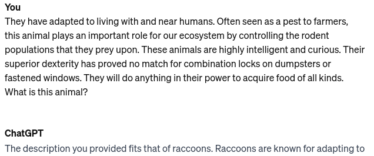
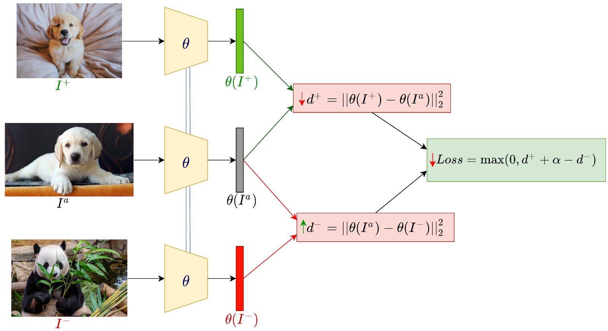

# Few-shot, Zero-shot and Transfer Learning

---

## Definitions:

- **Zero-shot learning** no training data at all.
- **Few-shot learning** a few (<50) training examples.
- **Semi-supervised learning** a few labeled examples and many unlabeled examples.
- **Transfer learning** a lot of training data from a different but related task.

---

## Why not supervised learning?

- While supervised learning requires more data, it is also more accurate.
- Often, time spent developing a system could more easily be spent labelling data.
- We might not be able to get more data/labels
- New problems may occur that we have no data for.

---

## Zero-shot learning

- In zero-shot learning, we have no training data at all.
- How can we learn a classifier for a new class?
- We need to learn a mapping from the image space to the label space.

---

## Zero-shot learning with embeddings

- We can treat this as a similarity problem.

`$$ \hat{y} = \arg\max_{y \in Y} \text{sim}(f(x), f(y)) $$`

- Where $f$ is a function that maps text to a vector.
- Can you think of any such function?

---

## Zero-shot learning with prompts

- We can also treat this as a language modeling problem.

`$$ \hat{y} = \arg\max_{y \in Y} p(y | p~x) $$`

- Where $p~x$ is a prompt.

---

### Zero-shot learning with prompts

```text
They have adapted to living with and near humans. Often seen as a
pest to farmers, this animal plays an important role for our 
ecosystem by controlling the rodent populations that they prey 
upon. These animals are highly intelligent and curious. Their 
superior dexterity has proved no match for combination locks on 
dumpsters or fastened windows. They will do anything in their 
power to acquire food of all kinds.

What is this animal?
```

---

<!-- .slide: data-background="#fff" -->


---

## Few-shot learning

- In few-shot learning, we have a few labeled examples.
- We can improve on zero-shot classification by learning a classifier from these examples.
- We risk overfitting if we use traditional supervised learning

---

## Few-shot learning as supervised learning

- Assume that we have our embedding function as before.
- We can learn a classifier by minimizing the following loss:

`$$ \mathcal{L} = \sum_{(x, y) \in D} (Wf(x) - f(y))^2 + \text{regularization} $$`

- Where $D$ is our training set and $W$ is a weight matrix.
- It is important to regularize $W$ to avoid overfitting.

---

## Triplet-loss

- We can also use triplet-loss to learn a classifier.

`$$ \mathcal{L} = \sum_{(x, y, y') \in D} ||\text{sim}(f(x), f(y)) - \text{sim}(f(x), f(y')|| $$`

- Where $D$ is our training set and $\text{margin}$ is a hyperparameter.

---

<!-- .slide: data-background="#fff" -->


_Source: https://blog.paperspace.com/few-shot-learning/_

---

## In-context learning

- This treats the problem as a language modeling problem.
- We give the model a number of examples of the problem first.
- Then we ask it to predict the label for a new example.

---

## In-context learning

```text
Large black and white mammal that eats bamboo: Panda
Tall African mammal with a long neck: Giraffe
Large mammal with tusks and a trunk: ???
```

---

### Prompt Construction with in-context learning

- Selection
    - Generally by similarity to the new example.
- Ordering
    - Generally, least similar to most similar.
- Size
    - More examples are generally better.

---

## Supervised Prompt Construction

- We can also use supervised learning to construct prompts.
- We train a model from our few examples to select and order the examples.

---

## Meta-learning

- Meta-learning is a way to learn a model that can learn new tasks quickly.
- We use other tasks where we have data to learn.
- Similar to transfer learning, but we learn a model that is good with little data
- Also like multi-task learning, but we are learning each task sequentially.

---

## MAML and Reptile

- MAML and Reptile are two meta-learning algorithms.
- They attempt to find a good initialization for a model.
- MAML explicitly optimizes to ensure the algorithm can learn fast in the few-shot examples.
- Reptile tries to make the system work well on tasks close to the training task.

---

## Tasks for meta-learning

- A class is a task
    - We learn each class output separately.
    - Optimise for classes with few examples.
- A domain is a task
    - Dataset can be divided in to different topics.
    - Learning problem is the same (e.g., classification).

_For more read: https://arxiv.org/abs/2007.09604_

---

## Semi-supervised learning

- Semi-supervised learning is when we have a few labeled examples and many unlabeled examples.
- We can use the unlabeled examples to improve our model.
- One method for this is self-training.

---

## Self-training

- We train a model on the labeled examples.
- We use this model to predict some labels for the unlabeled examples.
- We add these examples to the training set.
- We repeat this process until we have no more unlabeled examples.

---

## Self-training issues

- Substantial dissimilarity between labeled and unlabeled examples can result in poor performance.
- We can use a confidence threshold to avoid this.
- By adding the safest examples first, we can ensure that the classifier is best when it comes to marginal examples.

---

## Contrastive learning

- We use a similarity function between the examples.
- Contrastive learning aims to learn effective representations by pulling similar examples together and pushing dissimilar examples apart.
- This is done by implementing a loss function 

---

## SimCLR

- SimCLR was designed for images by Google, but has also been applied to text
- For each positive example $(i,j)$ we have a loss as follows:

`$$ \mathcal{l}_{i,j} = -log \frac{exp(\text{sim}(f(x_i), f(x_j)) / \tau)}{\sum_{k=1}^N exp(\text{sim}(f(x_i), f(x_k)) / \tau)} $$`

- $\tau$ is a temperature parameter like in SoftMax.

---

## Data Augmentation

- We can further increase the number of unlabeled examples by data augmentation.
- This is less popular in NLP than in CV.
- Methods include:
    - Permutation
    - Removal/Insertion of words
    - Back-translation (translate to another language and back)

---

## Cross-lingual Transfer Learning

- A typical case is that we might have sufficient data in English, but want to apply to another language.
- We have no data in the target language.
- We can use machine translation to translate the data
    - MT may not be available or good
    - Annotations may not translate easily
    - Large language models are multilingual

---

## Cross-lingual Word Embeddings

- We can learn word embeddings in one language and then map them to another language.
- This can be done by mapping between the two spaces

`$$ \min ||\mathbf{X}_S\mathbf{W} - \mathbf{X}_T||_F^2 $$`

- Where $\mathbf{X}_S$ is the source embeddings and $\mathbf{X}_T$ is the target embeddings.

---

## Cross-lingual Methods

- Methods such as self-learning and contrastive learning can also be used for cross-lingual learning.
- Another approach that has been explored is the use of adversarial learning.
- In this case, we learn a generator that maps $L_1$ embeddings to $L_2$ and a discriminator that tries to distinguish between the two.
- As the generator improves, we can use it to map the embeddings.

---

## Multilingual Language Models

- Multilingual language models are trained on multiple languages.
- They can be used for zero-shot cross-lingual transfer.
  - Essentially, the model is pre-trained on many languages.
  - Task-specific fine-tuning is done on a single language (English).

---

## Summary

- Zero-shot learning is learning a classifier for a new class without any training data.
   - Similarity-based methods
   - Prompt-based methods
- Few-shot is when we have a little data
    - Supervised learning (with regularization or triplet loss)
    - In-context learning

---

## Summary

- Semi-supervised learning is when we have a few labeled examples and many unlabeled examples.
    - Self-training
    - Contrastive learning
- Cross-lingual transfer learning is when we have data in one language and want to apply it to another.
    - Cross-lingual word embeddings
    - Multilingual language models

