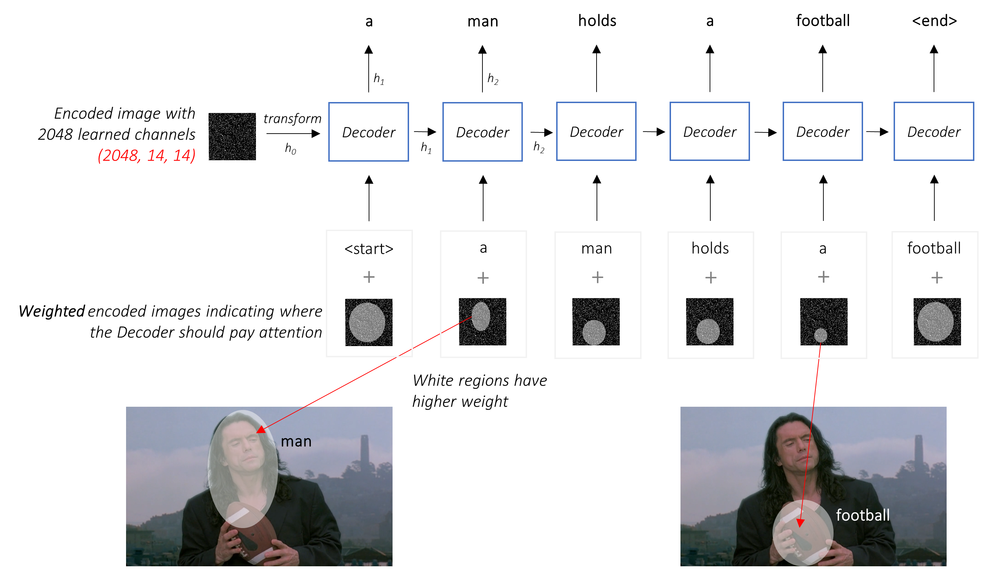
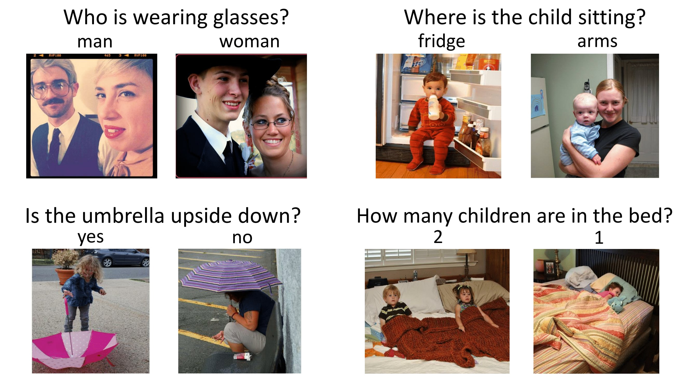

# Multimodal NLP

---

## Topics

* Speech Recognition
* Image Captioning
* Multimodal Fusion
* Visual Question Answering

---

## Speech Recognition

* **Speech Recognition** is the process of converting spoken words into text.
* Input is an audio signal, and output is a sequence of words.
* First step is to process the audio signal to extract features.

---

## Speech Signal Processing

* An audio signal is a 1D time series.
    * **Sampling Rate**: Number of samples per second.
    * **Bit Depth**: Number of bits per sample.
* **Preprocessing**: Remove noise, resample, etc.
* **Feature Extraction**: Extract features from audio signal.

---

## Speech Features

* **Mel-Frequency Cepstral Coefficients (MFCC)**: Popular feature for speech recognition.
* **Short-Time Fourier Transform (STFT)**: Another popular feature.
* These features are better suited for speech recognition than raw audio.
* Often further features are extracted using a Convolutional Neural Network (CNN).

---

## Speech Recognition Models

* **Hidden Markov Models (HMM)**: See CT5120.
* **Recurent Neural Networks (RNN)**: As we have seen in previous lectures.

---

<!-- .slide: data-background="#fff" -->

For more read: https://towardsdatascience.com/recognizing-speech-commands-using-recurrent-neural-networks-with-attention-c2b2ba17c837

---

## Image Captioning

* **Image Captioning** is the process of generating a textual description of an image.
* Input is an image, and output is a sequence of words.
* Again we need to extract features from the image

---

## Image Features

* **Convolutional Neural Networks (CNN)**: Popular for image feature extraction.
* **Pretrained Models**: Many pretrained models are available for image feature extraction.
    * E.g. VGG, ResNet, Inception, etc.
* **Fine-Tuning**: We can fine-tune these models for our specific task.

---

## Combining Image and Text

* Again we will use a Recurrent Neural Network (RNN) to generate the caption.
* We will include the image features using an attention mechanism.
* The attention mechanism allows the RNN to focus on different parts of the image.

---

Example of attention in generation

<!-- .slide: data-background="#fff" -->

---

Architecture of Image Captioning

<!-- .slide: data-background="#fff" -->

For more read: https://github.com/sgrvinod/a-PyTorch-Tutorial-to-Image-Captioning

---

## Visual Question Answering 

* **Visual Question Answering (VQA)** is the task of answering questions about an image.
* Input is an image and a question, and output is an answer.
* Similar to image captioning but now we have a text input.

---

<!-- .slide: data-background="#fff" -->

_Source: Making the V in VQA Matter: Elevating the Role of Image Understanding in Visual Question Answering (CVPR 2017)_

---

## VQA Architecture

* We can use the same architecture as image captioning.
* We will use the image features and question features to generate the answer.

---

## VQA Architecture

* Simple VQA architecture is to use a CNN to extract image features and an RNN to extract question features.
* We then combine these with a dot product
* A single layer perceptron is used to generate a **one-word** answer.
* An RNN (or transformer) can be used to generate a **sequence** of words.

---

<!-- .slide: data-background="#fff" -->

For more read: https://blog.allenai.org/vanilla-vqa-adcaaaa94336

---

## Multimodal Fusion

* **Multimodal Fusion** is the process of combining information from different modalities.
  * **Early Fusion**: Combine features from different modalities before task-specific processing.
  * **Late Fusion**: Combine features at prediction time.
  * **Intermediate Fusion**: Combine features in task-specific processing.

---

## Fusion Methods

* **Concatenation**: Concatenate features from different modalities.
* **Sum**/**Product**: Add/multiply features from different modalities.
* **Attention**: Use attention mechanism to combine features.
* **Neural Network**: Use a neural network to combine features.

---

## Challenges

* **Heterogeneity**: Different modalities have different data types.
* **Alignment**: Aligning features from different modalities.
* **Interpretability**: Understanding the combined features.

---

## Other tasks in Multimodal NLP

* **Multimodal Machine Translation**:
    * Translation with both text and images.
    * Image can help to disambiguate words.
* **Multimodal Sentiment Analysis**:
    * Useful for understanding sentiment in social media.
    * Image context is often vital for understanding sentiment.
    * Especially useful for sarcasm and memes.

---

<!-- .slide: data-background="#fff" -->

Irish State Vessel

---

<!-- .slide: data-background="#fff" -->

---

## Other tasks in Multimodal NLP

* **Emotion Recognition**
    * Emotion recognition from text alone is difficult.
    * Audio gives strong cues for emotion.
* **Multimodal Summarization**
    * Summarize a video with both audio and video.
    * Summarize a lecture with both slides and speech.

---

<!-- .slide: data-background="#fff" -->

---

## Other tasks in Multimodal NLP

* **Sign Language Recognition/Translation**
    * Recognize sign language from video.
    * Output is generally translation to spoken language (English).
    * Sign languages are not related to spoken languages
    * Irish Sign Language is not related to English and completely different from British Sign Language.

---

## Summary

* Multimodal NLP involves combining information from different modalities.
* Speech Recognition, Image Captioning, and VQA are popular tasks in multimodal NLP.
* We can use CNNs and RNNs to extract features from different modalities.
* Features are combined by multimodal fusion methods.

