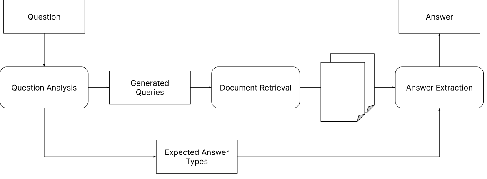
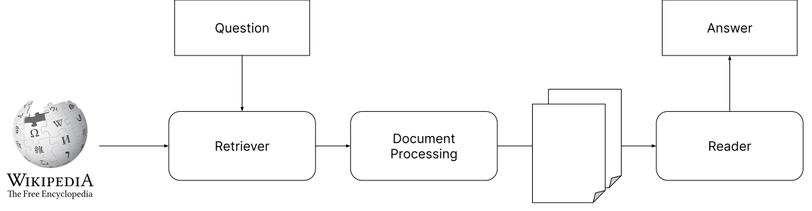

# Question Answering

---

## Open-domain vs Closed-domain

* **Open-domain** question answering systems are designed to answer questions on any topic. They are not restricted to a specific domain or set of topics.
* **Closed-domain** question answering systems are designed to answer questions on a specific domain or set of topics.

Also referred to as **textual QA** and **Knowledge Base QA**.

---

## Open-domain QA

* Open-domain QA is generally more scalable as text data is more abundant than structured data.
* Challenging to build as they require facts to be extracted from unstructured text.
* Relevant documents often need to be retrieved from a large corpus of text.
* **Machine Reading Comprehension** is a subfield of open-domain QA, where the system is required to read a passage of text and answer questions about it.

---

## Closed-domain QA

* Closed-domain QA is generally more accurate as it is easier to extract facts from structured data.
* Easier to build as the domain is more restricted.
* Mapping natural language questions to structured queries is not a trivial task.

---

## Factoid vs Non-factoid

* **Factoid** questions are questions that can be answered with a short fact or a few words. For example, "What is the capital of France?".
* **Non-factoid** questions are questions that require a longer, more complex answer. For example, "What are the causes of global warming?".

---

## Traditional Architecture of Open-domain QA

1. **Question Analysis**: The question is analyzed to determine its type and structure.
2. **Document Retrieval**: Relevant documents are retrieved from a large corpus of text.
3. **Answer Extraction**: The answer is extracted from the relevant passages.

---

<!-- .slide: data-background="#ccc" -->

Based on https://arxiv.org/pdf/2101.00774

---

## Question Analysis

* **Question Classification**: Determine the type of question (e.g., who, what, when, where, why, how).
* **Question Decomposition**: Break the question into sub-questions if necessary.
* **Keyword Extraction**: Extract the most important keywords from the question.

---

### Document Retrieval

* **Information Retrieval**: Retrieve relevant documents from a large corpus of text.
* Boolean retrieval, vector space model, and language models are commonly used for this task.
   * Boolean retrieval: Documents are retrieved based on the presence or absence of keywords.
   * Vector space model: Documents are represented as vectors in a high-dimensional space, and similarity is measured using the cosine similarity.
   * Language models: Documents are ranked based on their likelihood of generating the query.

---

## Answer Extraction

* Passages are analyzed for relevant information.
* Answers are then selected from the text based on their relevance and correctness.
* Named entity recognition, part-of-speech tagging, and dependency parsing are commonly used for this task.

---

## Deep Learning for QA

* **End-to-End Models**: Deep learning models that take the question and the document as input and output the answer.
* **Retriever-Reader Models**: A two-stage approach where a retriever model first retrieves relevant documents, and a reader model then extracts the answer from the retrieved documents.

---

<!-- .slide: data-background="#ccc" -->

Derived from https://arxiv.org/pdf/2101.00774

---

## Retrievers

* **Retrievers** are models that retrieve relevant documents from a large corpus of text.
* Sparse retrievers use simple keyword matching or TF-IDF to retrieve documents.
* Dense retrievers use neural networks to learn dense representations of documents and queries, and retrieve documents based on similarity in the learned space.
* Iterative retrievers use a combination of sparse and dense retrievers to improve retrieval performance.

---

## Readers

* **Readers** are models that read a passage of text and extract the answer to a question.
* One approach is **extractive**, where the answer is a span of text from the passage.
* Another approach is **generative**, where the answer is generated from scratch based on the question and the passage.

---

### Retrieval-Augmented Generation

* Using a retriever to retrieve relevant documents and then using a generator to generate the answer based on the retrieved documents.
* This can solve non-factoid questions that require a longer, more complex answer.
* Ensures the LLMs have access to the most relevant information.
* Avoids retrains the LLMs on the entire corpus.

---

## Knowledge Base QA

* **Knowledge Base QA** systems are designed to answer questions using structured knowledge bases.
* Knowledge bases are collections of structured data, such as databases or ontologies.
* The main challenge is mapping natural language questions to structured queries.

---

## Architecture for Knowledge Base QA

1. **Question Analysis**: The question is analyzed to determine its type and structure.
2. **Query Generation**: A structured query is generated from the question.
3. **Query Ranking**: The structured query is executed on the knowledge base, and the results are ranked.
4. **Answer Decoding**: The results are decoded into a natural language answer.

---

<!-- .slide: data-background="#ccc" -->

---

## Question Analysis

* For KBQA, many questions can be answered by the semantics of the words

> Give me actors born in Berlin

* We need only understand that we are querying for `actor`, `bornIn` and `Berlin`.
* The structure of the knowledge base will be used to generate the query.

---

## Query Generation

* The structured query is generated from the question.
* We often use templates and the database schema to generate the query.
* For example, if we know that `bornIn` is a column (property) of actors then we can query this value.

---

## Query Ranking

* Queries may be ranked according to:
    * Number of words from query matched
    * Distance of matching (e.g., `born` vs. `bornIn`)
    * Relevance
    * Size of the query and result set

---

## Answer Decoding

* The results are decoded into a natural language answer.
* For example, if the query returns a list of actors, we may need to format this list into a natural language answer.
* This can also be done as **retrieval-augmented generation**.

---

## Challenges in QA

* Datasets do not contain "sufficient" data so distant supervision is used
* Retrieval of relevant documents is challenging
* Questions may be ambiguous

---

## Conversational QA

* **Conversational QA** systems are designed to answer a sequence of questions in a conversation.
* The system needs to maintain context across questions and answers.
* See lecture on chatbots last semester.

---

## Conclusion

* Question answering is a challenging task that requires a combination of information retrieval, natural language processing, and knowledge representation and reasoning.
* Open-domain and closed-domain QA systems have different strengths and weaknesses.
* Generative models are becoming increasingly popular for QA tasks.
