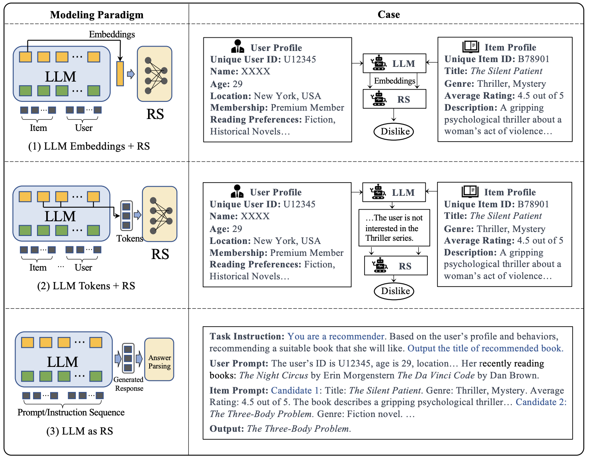

# Recommender Systems

---

## Recommender Systems

* Recommender systems provide recommendations
* Used in:
    * e-Commerce
    * Social Networks
    * Video Streaming Services
    * Education/academia

---

## Recommendation System Models

* Content-based filtering
    * Recommend items similar to what the user likes
* Collaborative filtering
    * Recommend items based on what similar users like
* Hybrid models
    * Combine content-based and collaborative filtering

---

## Collaborative Filtering

* Calculate similarity between users
* Methods include:
    * Clustering
    * Nearest Neighbors
    * Matrix Factorization

---

## Cold-Start Problem

* For new users we have no data
* New items also have no data
* We need content-based filtering to handle these

---

## Content-based Filtering

* Natural language processing techniques analyse text content
* Provide recommendations based on text similarity
* Also use metadata such as genre, director, actors, etc.

---

## TF-IDF approaches

* We can use TF-IDF (Term Frequency-Inverse Document Frequency)
* TF-IDF measures the importance of a word in a document
* Vectorise the text data with TF-IDF and use cosine similarity to find similar items

---

## Vector Space Model

* Represent text documents as vectors
* Can be done with a bag-of-words model
* Each word is a dimension in the vector space
* Apply cosine similarity

---

## Deep Learning Approaches

* Use models such as BERT to embed documents
* Cosine similarity of these vectors can find similar items
* Siamese networks can further train these models

---

## Hybrid Models

* **Weighted Hybrid**
    * Combine scores from content-based and collaborative filtering
* **Switching Hybrid**
    * Use one model when the other has no data
* **Cascaded Hybrid**
    * Use one model to pre-filter items for the other model

---

## Hybrid Models

* **Feature Combination**
    * Combine features from both models
* **Meta-level**
    * Use predictions from one model as features for the other model

---

## Large Language Models for Recommendation

* LLMs can extract high-quality features from text
* Leverage external knowledge encoded in the model
* Can even directly generate recommendations

---

## LLM Embedding + RS

* LLMs act as feature extractors
* Traditional recommendation systems can use these features

---

## LLM Tokens + RS

* LLMs generate tokens (text)
* These tokens capture potential preferences
* Content-based filtering can use these tokens

---

## LLM as RS

* LLMs can directly generate recommendations
* Input is generally the profile description
* Output is a list of recommended items

---

<!-- .slide: data-background="#fff" -->

From https://arxiv.org/abs/2305.19860

---

## Non-Tuning Approaches

* Prompting
    * Use prompts to guide the LLM to generate recommendations
* In-context learning
    * Give examples to improve the recommendation

---

## Prompt Design for Recommendations

* User data (e.g., clicks) can be hard to translate into natural language
* ID-like features do not work well with LLMs
* Context length limits amount of user history that can be included

---

## Tuning Approaches

* Fine-tuning
    * Train the LLM on a recommendation task
* Prompt-tuning
    * Generate a prompt based on training data
    * Continuous or discrete prompts can be used

---

## Model Bias

* Position
    * Model may recommend items at the top of the list
* Popularity
    * Popular items may be recommended more
* Fairness
    * LLMs have biases in gender, race etc.

---

## Explainability

* LLMs can generate explanations
* These explanations are often clearer than human-written models
* These explanations may not be accurate however

---

## Evaluation of Recommender Systems

* Recommendation can be boolean or ranked
* Boolean metrics include:
    * Precision
    * Recall
    * F1-score

---

## Evaluation of Recommender Systems

* Ranked metrics include:
    * NDCG (Normalized Discounted Cumulative Gain)
    * MRR (Mean Reciprocal Rank)
* Evaluating generative models is more challenging

---

## Conclusion

* Recommender systems are widely used
* Content-based and collaborative filtering are the main models
* LLMs can be used to improve recommendation quality

